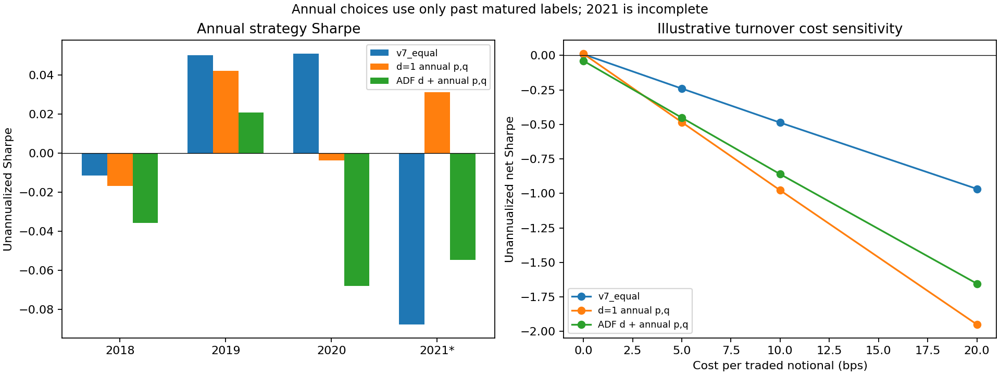
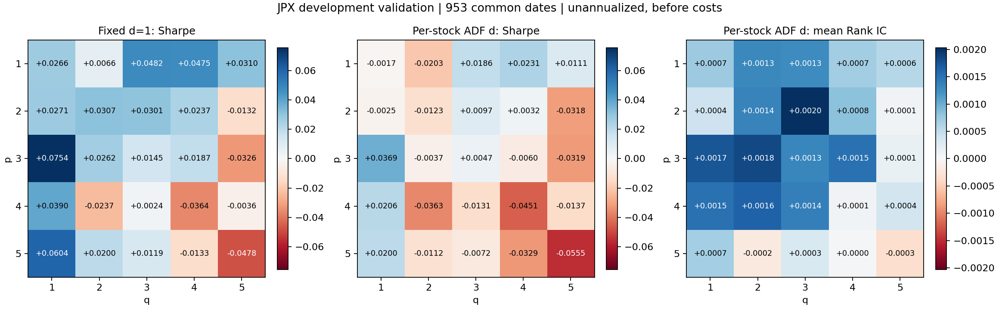

# JPX：5% ADF 差分與年度選階實測（2026-10-04）

**本輪完成。主策略 Sharpe -0.039812，固定 d=1 年度選階 +0.010988，差異 -0.050800。**
結果來自已反覆參與研究的歷史 validation；正式 test 未讀取、未評分，正式基準仍為 v7_equal。
本輪沒有看到加入 ADF 自動選 d 帶來改善。年度 p,q 路徑改變、差分模型改變及缺價後備都可能影響結果；匹配對照可以拆開觀察，但不能把全部主策略差異直接歸因於差分階數。ADF 是單位根檢定程序，通過檢定並不保證交易排序較好。

共同評估日數：**953**；原資料 953 日、1,864,363 個股票日，ValidationYear 2018–2021（2021 不完整）。Sharpe 均為官方每日 spread 的平均／樣本標準差，未年化、主表未扣成本。

## 主要策略比較

| 策略 | Sharpe | 平均每日 Rank IC | 每日 Target MSE 平均 |
|---|---:|---:|---:|
| 正式基準 v7_equal | +0.007679 | -0.000734 | 0.000665433 |
| 固定 d=1、年度選 p,q | +0.010988 | +0.000501 | 0.00060484664 |
| 逐檔 ADF 選 d、年度選 p,q | -0.039812 | +0.000269 | 0.00061354201 |
| 固定 (3,1,1)，既有全期事後候選 | +0.075442 | +0.002398 | 0.00059897881 |
| 固定 d=1，沿用 ADF 的年度 p,q | -0.021795 | +0.000591 | 0.00061015269 |
| 固定 d=1，同 ADF 年度 p,q 與後備覆蓋 | -0.022560 | +0.000558 | 0.00061005492 |

兩條「沿用 ADF 年度 p,q」對照是主策略路徑的機制診斷，沒有自行再選勝者。固定 (3,1,1) 是既有全期事後勝出候選，不能當作逐年可以提前知道的答案。

## 每年實際選出的 p,q

| 年度 | 選模截止 | 成熟歷史日數 | 固定 d=1 家族 p,q | ADF 家族 p,q |
|---|---|---:|---|---|
| 2018 | 2017-12-28 | 0／0 | (1,1) | (1,1) |
| 2019 | 2018-12-27 | 243／243 | (5,2) | (5,2) |
| 2020 | 2019-12-27 | 484／484 | (3,2) | (5,3) |
| 2021（部分年度） | 2020-12-29 | 726／726 | (5,1) | (2,3) |

歷史日數欄依序為固定 d=1／ADF 家族。2018 固定 p=q=1 作為初始化；之後使用全部既往年度的成熟樣本外績效，Sharpe 第一、Rank IC 第二，完全同分再取較低階。每年邊界最後兩個前期訊號的 Target 尚未成熟，因此不參與當年度選模。

## 分年與排除初始化年度

| 策略 | 2018 | 2019 | 2020 | 2021（部分） | 2019–2021 合併 |
|---|---:|---:|---:|---:|---:|
| 正式基準 v7_equal | -0.011514 | +0.050067 | +0.050857 | -0.087605 | +0.013494 |
| 固定 d=1、年度選 p,q | -0.016685 | +0.042208 | -0.003731 | +0.031247 | +0.020175 |
| 逐檔 ADF 選 d、年度選 p,q | -0.035590 | +0.020948 | -0.068033 | -0.054526 | -0.041162 |

## ADF 的實際分布

| 年度 | d=0 | d=1 | d=2 | 未選 d／後備 |
|---|---:|---:|---:|---:|
| 2018 | 115 | 1713 | 13 | 159 |
| 2019 | 91 | 1794 | 0 | 115 |
| 2020 | 106 | 1814 | 1 | 79 |
| 2021 | 123 | 1827 | 2 | 48 |

共新增 11,275 次股票年度估計，重用 178,700 次既有 d=1 結果，10,025 次候選股票年度採 ADF 可用性後備。401 個未選 d 股票年度包括 299 個原有效歷史不足，以及 102 個連續檢定樣本不足；本次沒有因差分到 d=2 仍未拒絕單位根而後備的案例。

ADF 使用 5% critical value、常數項、AIC 選 lag；在 d=0、1、2 中選第一個拒絕單位根者。檢定只用年度 training 的最長連續有限區段，ARIMA 仍用完整 expanding 歷史並保留缺價。d=0 估常數均值；d>=1 無漂移。ADF 的拒絕是本次操作決策，不宣稱已知道真實過程必然平穩。

**缺價處理的限制：**原日曆的 2020-10-01 是全市場缺價日。依本輪事先固定的最長連續區段規則，2021 年 1,974 個可進入檢定流程的股票年度，其 ADF 區段均未涵蓋訓練末日；其中 1,901 個截至 2020-09-30，其餘更早。ARIMA 係數仍用截至 2020-12-29 的完整 expanding 價格。不能把本輪 ADF 說成使用了 2021 fold 的所有訓練觀測；完整区段診斷見 `adf_segment_diagnostics.json`。

## 全部 25 組候選

每組 p,q 跨年固定；ADF 家族的 d 仍按每檔、每年度檢定變動。下表的全期排序是開發資料上的事後描述，與上面的年度因果選模分開。

| p | q | 固定 d=1 Sharpe | ADF Sharpe | Sharpe 差 | 固定 d=1 Rank IC | ADF Rank IC |
|---:|---:|---:|---:|---:|---:|---:|
| 1 | 1 | +0.026643 | -0.001682 | -0.028325 | +0.001365 | +0.000730 |
| 1 | 2 | +0.006643 | -0.020309 | -0.026952 | +0.001947 | +0.001308 |
| 1 | 3 | +0.048231 | +0.018591 | -0.029641 | +0.001804 | +0.001271 |
| 1 | 4 | +0.047483 | +0.023135 | -0.024348 | +0.001057 | +0.000698 |
| 1 | 5 | +0.031016 | +0.011123 | -0.019893 | +0.001009 | +0.000583 |
| 2 | 1 | +0.027117 | -0.002459 | -0.029576 | +0.001168 | +0.000424 |
| 2 | 2 | +0.030734 | -0.012345 | -0.043079 | +0.002027 | +0.001352 |
| 2 | 3 | +0.030134 | +0.009695 | -0.020439 | +0.002502 | +0.002027 |
| 2 | 4 | +0.023689 | +0.003230 | -0.020459 | +0.001280 | +0.000824 |
| 2 | 5 | -0.013185 | -0.031809 | -0.018624 | +0.000640 | +0.000067 |
| 3 | 1 | +0.075442 | +0.036880 | -0.038563 | +0.002398 | +0.001730 |
| 3 | 2 | +0.026216 | -0.003724 | -0.029940 | +0.002442 | +0.001826 |
| 3 | 3 | +0.014505 | +0.004696 | -0.009809 | +0.001862 | +0.001327 |
| 3 | 4 | +0.018704 | -0.006044 | -0.024748 | +0.002162 | +0.001515 |
| 3 | 5 | -0.032598 | -0.031860 | +0.000738 | +0.000274 | +0.000145 |
| 4 | 1 | +0.038965 | +0.020631 | -0.018333 | +0.001976 | +0.001509 |
| 4 | 2 | -0.023694 | -0.036313 | -0.012619 | +0.001882 | +0.001640 |
| 4 | 3 | +0.002422 | -0.013146 | -0.015568 | +0.001929 | +0.001378 |
| 4 | 4 | -0.036386 | -0.045074 | -0.008688 | +0.000395 | +0.000068 |
| 4 | 5 | -0.003643 | -0.013700 | -0.010056 | +0.000359 | +0.000376 |
| 5 | 1 | +0.060424 | +0.019973 | -0.040451 | +0.001415 | +0.000690 |
| 5 | 2 | +0.019967 | -0.011235 | -0.031201 | +0.000214 | -0.000202 |
| 5 | 3 | +0.011938 | -0.007161 | -0.019099 | +0.000602 | +0.000309 |
| 5 | 4 | -0.013300 | -0.032919 | -0.019619 | +0.000254 | +0.000022 |
| 5 | 5 | -0.047762 | -0.055518 | -0.007756 | -0.000217 | -0.000334 |

## 差異的不確定性

| ADF 年度主策略相對對照 | Sharpe 差 | 配對邊際 95% 區間 |
|---|---:|---|
| v7_equal | -0.047490 | [-0.138763, +0.053584] |
| 固定 d=1 年度選階 | -0.050800 | [-0.097274, -0.005702] |
| 相同 p,q 路徑與 ADF 後備覆蓋的 d=1 | -0.017251 | [-0.043386, +0.008249] |

20 日循環區塊配對 bootstrap、2,000 次、seed=20261004。這裡重抽已實現策略路徑，沒有在每次抽樣重做訓練及年度選模，因此是條件於該選模路徑的探索區間。候選 CSV 另有固定 25 組相對 v7 的近似同時區間；兩者都沒有校正全部歷史研究決策，也不構成新 holdout 證據。

## 換手與成本敏感度

| 策略 | 0 bps Sharpe | 5 bps | 10 bps | 20 bps | 平均損益兩平成本 bps |
|---|---:|---:|---:|---:|---:|
| 正式基準 v7_equal | +0.007679 | -0.240673 | -0.487256 | -0.967104 | 0.1545 |
| 固定 d=1、年度選 p,q | +0.010988 | -0.484126 | -0.977229 | -1.948808 | 0.1109 |
| 逐檔 ADF 選 d、年度選 p,q | -0.039812 | -0.451830 | -0.860425 | -1.653144 | -0.4826 |

兩側各單位名目曝險：gross = 官方 spread / 200；成本 = 單位成交成本 × 相鄰目標權重 L1 差。含初始建倉与末次平倉，忽略價格漂移造成的實際權重變化、借券費、滑價細節及成交限制，屬換手敏感度，不是完整帳戶回測；沒有把官方 spread 直接複利。

## 數值與資料核對

- 新估計狀態：{"ok": 11265, "fit_not_converged_or_invalid": 6, "training_exception": 4}。失敗案例詳見 `fit_audit_summary.json`，不刪股票。
- 新估計程序內完成 1,275 次截斷／未來擾動核對；獨立程序另有 63 次。最大獨立價格誤差 4.55e-13。
- ADF training 邊界、原始未縮放 ADF 決策、缺價區段選擇、未到期 Target 排除及年度選模未來擾動核對均通過。
- 重用 d=1 分數與後備標記逐筆精確相等；主策略及新候選由官方評分函數獨立核對；v7 逐日 spread 重現。
- 各策略共同排除日期：無。若原始 Target 缺失落在選中持倉，該日不當成零報酬；完整日期列表與各候選原始日數保留。
- 原始 Target 與本地因果價格比值的既有微小差異未在本輪修正；全部模型仍用相同原始 Target。

## 來源與重現

- 起始 Git commit：`6f6a57a515cd05f0676646479140d63e8ad07832`；來源 inventory：`data/inventories/snapshot-2026-09-28-arima-learning.json`。
- 本次查得來源 `snapshot-2026-09-28-arima-learning` 仍是草稿 Release，root index 未列入，不能宣稱它已正式發布。54 個本機原檔共 551,748,534 bytes 與版本化 SHA-256 清單一致；另分段完整取回價格檔 5,876,864 bytes，SHA-256 與本機完全一致。沒有宣稱完整下載或核對整個舊資料包。
- 本轮新 Release 保存所需價格／Target keys、兩個完整候選家族的逐筆預測、參數、ADF 明細、估計 checkpoint、選模紀錄、後備與核對資料；程式、設定、報告及小型結果進 Git。同步與實際清理狀態以 `sync_status.json`、`cleanup_receipt.json` 為準。
- 完整參數比較：`leaderboard.csv`；逐年比較：`annual_candidates.csv`；策略表：`strategy_metrics.csv`；成本表：`cost_sensitivity.csv`。
- ACF/PACF lag 1–20 及檢定明細保存在 `adf_decisions.json`；新擬合模型的 training Ljung–Box 診斷在 checkpoint audit 中，未拿來另行選模。
