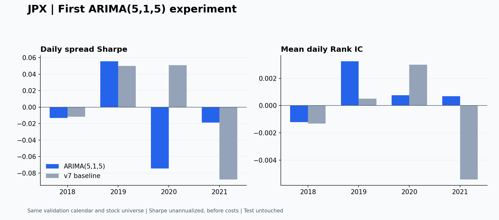

# JPX：ARIMA(5,1,5) 第一輪探索回測

執行日期：2026-09-23。使用者提出假設與階數；程式實作、回測及核對由助理完成。

## 這次得到什麼

在共同 953 個驗證日，ARIMA 的 Sharpe 低於既有 v7。這只是本輪固定設定的結果，不能直接推論 ARIMA 整個家族有效或無效，也不能單獨證明 shock 項有幫助。

| 模型 | Sharpe（未年化、未扣成本） | 平均每日 Rank IC |
|---|---:|---:|
| ARIMA(5,1,5) | -0.019735 | +0.000865 |
| v7_equal 基準 | +0.007679 | -0.000734 |

兩者 Sharpe 差值為 -0.027414。20 日區塊配對重抽樣 2,000 次，探索性 95% 區間為 [-0.130001, +0.069528]。區間跨過 0，這輪差異仍有不確定性。

Rank IC 評估全部有標籤股票的排序；官方 Sharpe 評估前後各 200 檔構成的每日多空報酬差，兩者可能給出不同方向。平均 Rank IC 不包括 Target 全同、因此相關係數未定義的日子。

## 你的假設與實際測試範圍

原假設：歷史價格變化與過去未預期衝擊中，存在目前價量模型尚未充分利用的時間關係。

本輪先測單獨 ARIMA 排名，尚未把 ARIMA 與 g 合併，也沒有進行「有 MA 項 vs 無 MA 項」對照。與 v7 的差異包含輸入資訊、模型結構、估計方式和更新頻率，所以不能把結果全部歸因於 shock。

## 實際跑的是什麼模型

每檔股票各有一組參數。P 為調整收盤價，ΔP[t] = P[t] − P[t−1]：

ΔP[t] = φ1·ΔP[t−1] + … + φ5·ΔP[t−5] + θ1·ε[t−1] + … + θ5·ε[t−5] + ε[t]

本輪無漂移／常數項。ε 是模型的創新誤差，不是已被辨認的特定新聞事件。AR 項會繼續傳遞過去影響，所以 MA(5) 不表示所有 shock 到第六天就一定完全消失。

預測時，尚未發生的 shock 使用模型假設下的條件期望 0；這不表示未來真的沒有衝擊。第二步價格預測只能承接第一步預測與當時已知狀態，不能使用隔天真正發生的價格或誤差。

- 固定使用 p=5、d=1、q=5，沒有搜尋其他階數。
- 每個 ValidationYear 開始前，以前方最多 252 個資料日估計；至少 126 個有效價格。2017 年資料用來建立最初模型。
- 年內固定係數，每日依新價格更新過濾狀態。這與 v7 每天更新係數的做法不同。
- 價格尺度轉換只用訓練資料；因果調整因子與原價量模型相同。不裁切有限極端值。
- 最大概似估計使用 L-BFGS；先 500 步，未收斂再從目前參數繼續最多 1,000 步。AR 平穩、MA 可逆約束保持一致。
- 個股缺失價格保留在日曆裡，以狀態空間過濾處理，不把前後兩個觀測偷偷視為相鄰交易日。

## 價格預測怎麼變成 JPX 排名

訊號日 t 收盤後，預測 P[t+1|t]、P[t+2|t]，排名分數為：

score[t] = P[t+2|t] / P[t+1|t] − 1

這個比值是價格點預測構成的報酬代理，不保證等於 E[P[t+2]/P[t+1]−1 | t]。它對齊的是下一日收盤到再下一日收盤，不是從今天到後天的累積報酬。

每日分數由高到低排名；同分依股票代碼。依官方規則選前後各 200 檔、名次權重 2→1。沒有自由調整投入金額、減倉或跳過某天交易。

## 分期結果

年份沿用原始 ValidationYear 標籤，實際訊號日為 2017-12-29 至 2021-12-01。

| ValidationYear | ARIMA Sharpe | v7 Sharpe | ARIMA Rank IC | v7 Rank IC |
|---|---:|---:|---:|---:|
| 2018 | -0.013071 | -0.011514 | -0.001207 | -0.001318 |
| 2019 | +0.055651 | +0.050067 | +0.003248 | +0.000502 |
| 2020 | -0.074522 | +0.050857 | +0.000753 | +0.002987 |
| 2021 | -0.018739 | -0.087605 | +0.000686 | -0.005408 |

## 收斂與後備處理

共 8,000 個股票年度模型，22 個需要第二次優化嘗試。

| 狀態 | 股票年度數 |
|---|---:|
| 成功估計與預測 | 7,675 |
| 歷史價格不足 | 299 |
| 數值求解失敗 | 16 |
| 優化未收斂 | 7 |
| 回報收斂但內部變異數無效 | 3 |

資料不足、未收斂、無有效尺度或預測價格非正時，以零報酬分數作後備；股票仍在完整排名中。因此這份結果包含後備規則，不是全部股票日都由成功的 ARIMA 產生訊號。

後備占 37,193/1,864,363 個股票日（1.99%）；進入官方前後各 200 檔的後備股票日共 0。同為 0 的後備分數由代碼決定順序，這也可能影響所選股票組合。

最終數值核對另發現 3 個模型雖回報收斂，內部創新變異數卻無效；已按事前數值失敗後備規則處理，並重算結果。接受其餘模型前，已重查完整 forward filter 的變異數有效性。這些修正只看數值有效性，未使用驗證績效挑選模型。

## 核對與限制

- 完整股票池共 1,864,363 個股票日，與 v7 的日期及代碼逐列對齊。
- 全部估計段嚴格早於該年第一個預測日；模型工作函式不接收 Target。
- 內建 48 次、另行獨立 96 次截斷／未來資料擾動檢查通過。使用 forward filter，沒有使用會看到未來的 smoothed states。
- 官方 Sharpe 公式獨立重算通過，與本輪實作差值 4.16e-17；v7 每日多空報酬差亦重現。
- 原始 Target 原樣使用。部分列與本地因果調整價格比值有微小差異：可對照列最大約 5.368 個基點；本輪未確定成因，沒有擅自覆寫官方標籤。
- 無漂移、252 日窗口、126 日最低資料量、年度重估與後備規則，都是本輪具體實作設定，不能只寫成「試過 ARIMA(5,1,5)」而省略。
- test 沒有讀取或評分。既有 validation 已被多次探索，本輪不能當成新的泛化證據；正式基準未改動。

## 你可以從這次練習什麼

1. 用自己的話解釋：第一個 5、1、最後一個 5 分別改變了模型什麼。
2. 根據分期結果，寫出「支持了什麼、沒有支持什麼」，避免把模型比較直接說成 shock 的因果證據。
3. 若下一輪要驗證 shock 項的額外貢獻，可自行提出同設定、移除 MA 項的對照；本輪尚未執行。
4. 推廣到其他市場前，重新確認價格調整、預測時點、目標報酬區間與交易規則；向他人展示時一併揭露後備與驗證資料重用。

## 來源

- [JPX 官方評分程式](https://www.kaggle.com/code/smeitoma/jpx-competition-metric-definition)
- [statsmodels ARIMA 文件](https://www.statsmodels.org/stable/generated/statsmodels.tsa.arima.model.ARIMA.html)；實際執行版本 0.14.6。
- 既有 v7_equal 結果與逐日排名、原始 JPX train_files/stock_prices.csv。來源雜湊、環境版本及詳細設定見資料包。
