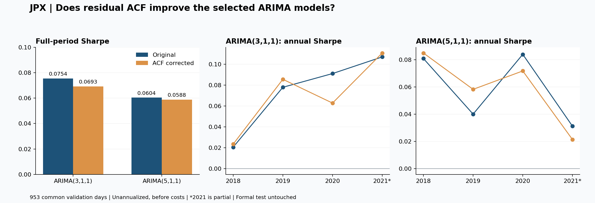
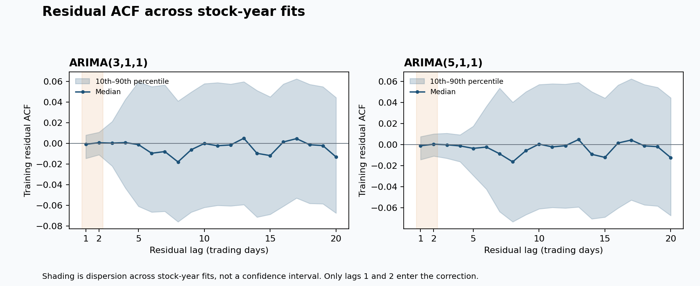

# JPX：ARIMA 殘差 ACF 修正實驗

## 結果

已依使用者確認，只為 ARIMA(3,1,1)、ARIMA(5,1,1) 分別加入殘差 ACF 修正，保留原 ARIMA 參數與估計方式；沒有把兩組模型平均，也沒有改用 Target MSE 訓練。本次修改的目的是檢驗原模型剩下的 error 是否含有可用的延續性。

**本輪兩組修正後的整段 Sharpe 與平均 Rank IC 均略降，沒有觀察到整體改善。** 差異信賴區間均包含零，因此也不能把小幅下降解讀為 ACF 修正必然有害。原模型繼續保留。

| ARIMA | 原始 Sharpe | 加 ACF Sharpe | 差異 | 原始 Rank IC | 加 ACF Rank IC |
|---|---:|---:|---:|---:|---:|
| (3,1,1) | +0.075442 | +0.069266 | -0.006177 | +0.002398 | +0.002327 |
| (5,1,1) | +0.060424 | +0.058801 | -0.001623 | +0.001415 | +0.001367 |

v7 同期 Sharpe 為 +0.007679。全部比較使用相同 953 日；未年化、未扣成本，正式 test 未使用。前一輪已在相同驗證資料中挑選這兩組模型，所以這是探索性追蹤實驗，並非新的獨立測試證據。

## 你的公式如何落實
先將筆記中的 X 明確定義為價格差分 ΔP，而非價格本身。d=1 的原模型為：

ΔP[t] = φ₁ΔP[t−1] + … + φₚΔP[t−p] + e[t] + θ₁e[t−1]，p∈{3,5}。

這裡的 e[t] = P[t] − 原 ARIMA 的 P[t|t−1]，也就是「實際價格減去原模型的一步預測價格」，從原模型的 forward filter 取得。它不是 JPX Target 的預測誤差，也不是平方誤差；ACF 不套用在價格上。理論上的真正 innovation 應無自相關，但有限資料估出的模型殘差可能還留有結構，因此你的假設可以檢驗。

以年度訓練殘差估計 ρ₁=ACF(e,1)、ρ₂=ACF(e,2)，本輪固定：

u₁ = 預測 e[t+1|t] = ρ₁e[t]

u₂ = 預測 e[t+2|t] = ρ₂e[t]

這採用第一張筆記的「兩個直接落後相關」，沒有改成第二張筆記可能代表的 AR(1) 遞迴，因此 **u₂ 不是 ρ₁²e[t]**。修正強度固定為 1，不另外學習倍數或偏差截距，沿用原模型對 innovation 的零平均假設。估計 ACF 本身仍會先扣除樣本平均。

ACF 是相關係數，不是自動產生 error 的模型。ρₕe[t] 是在殘差近似平穩、各期變異數相同且均值為零時，使用最新單一殘差的線性修正假設。一般迴歸斜率為 Corr(e[t+h],e[t])×SD(e[t+h])/SD(e[t])，只有變異數相同時才化為相關係數；不能在所有情況直接把相關係數等同迴歸係數。

設 B₁、B₂ 為原 ARIMA 的明天、後天價格預測；u₁、u₂ 已換回價格單位後，正確傳遞修正為：

P*[t+1|t] = B₁ + u₁

P*[t+2|t] = B₂ + (1+φ₁+θ₁)u₁ + u₂

score[t] = P*[t+2|t] / P*[t+1|t] − 1

第二天要包含 (1+φ₁+θ₁)u₁，因為明天的修正會經由價格累積、AR 與 MA 三個部分傳遞。不能只在後天價格加上 u₂，也沒有再重複加一次原模型已使用的 θ₁e[t]。實際資料到來時，仍更新原模型的殘差；不把修正後預測產生的新殘差混回原 filter。

## 分年表現

| ARIMA | 驗證年 | 原始 Sharpe | 加 ACF Sharpe | 差異 |
|---|---:|---:|---:|---:|
| (3,1,1) | 2018 | +0.020602 | +0.023506 | +0.002904 |
| (3,1,1) | 2019 | +0.077903 | +0.085556 | +0.007652 |
| (3,1,1) | 2020 | +0.091050 | +0.062801 | -0.028249 |
| (3,1,1) | 2021 | +0.106982 | +0.110706 | +0.003724 |
| (5,1,1) | 2018 | +0.080903 | +0.084945 | +0.004043 |
| (5,1,1) | 2019 | +0.040065 | +0.058266 | +0.018201 |
| (5,1,1) | 2020 | +0.083988 | +0.071783 | -0.012205 |
| (5,1,1) | 2021 | +0.031247 | +0.021440 | -0.009807 |

ARIMA(3,1,1) 的修正在 2018、2019、2021 改善，但 2020 下降較多，整體仍下降。ARIMA(5,1,1) 在 2018、2019 改善，2020、2021 下降。這表示「多數年份上升」不保證整段 Sharpe 上升；不能挑掉下降年份來報告。2021 為截至 12 月初的部分年度。

## 殘差裡還有多少短期自相關

表中是各股票年度估計的 |ACF| 中位數，並非某一檔股票的 ACF，也不是將所有股票拼成一條時間序列。ACF 偏小與原 ARIMA 已解釋多數短期線性延續性的情況相符，但不等於已證明殘差完全不可預測。

| ARIMA | 年度 | ACF 可估計筆數 | ACF(1) 絕對值中位數 | ACF(2) 絕對值中位數 | Ljung–Box BH<0.05／可檢查數 |
|---|---:|---:|---:|---:|---|
| (3,1,1) | 2018 | 1875/2000 | 0.012926 | 0.011835 | 4/1816 |
| (3,1,1) | 2019 | 1909/2000 | 0.003109 | 0.003774 | 7/1830 |
| (3,1,1) | 2020 | 1942/2000 | 0.002438 | 0.002866 | 30/1851 |
| (3,1,1) | 2021 | 1974/2000 | 0.002206 | 0.002458 | 不適用（有缺值） |
| (5,1,1) | 2018 | 1875/2000 | 0.012577 | 0.011190 | 1/1815 |
| (5,1,1) | 2019 | 1909/2000 | 0.003024 | 0.003645 | 9/1830 |
| (5,1,1) | 2020 | 1941/2000 | 0.002419 | 0.002825 | 19/1850 |
| (5,1,1) | 2021 | 1974/2000 | 0.002187 | 0.002489 | 不適用（有缺值） |

ACF 圖的陰影是股票年度估計之間的第 10～90 百分位，**不是信賴區間**。只將 lag 1、2 用於預測；其餘 lag 3～20 供診斷。

Ljung–Box 以 lag 10、自由度扣除 p+q 檢查，只對連續無缺值殘差計算；BH 在各模型各年度的可檢查股票內調整多重檢定，供探索性診斷，沒有拿來篩股票或開關訊號。2021 所用訓練序列含缺值，因此這欄不適用，不代表全部殘差通過白噪音檢定。檢定仍受殘差異質變異與跨股票相依等假設限制。

## 預測未來 error 本身有變準嗎

下表只比較有套用修正、且同一驗證年度內能觀察到未來原模型殘差的資料。MSE 單位為訓練期價格差分標準差正規化後的殘差平方，不是日圓平方或 Target MSE；年度末不足 h 天的預測不列入此診斷。這些未來觀察只用於事後評估，沒有參與 ACF 估計或當日預測。

| ARIMA | 提前天數 h | 可比較筆數 | 預測 error=0 的 MSE | ACF 預測 error 的 MSE | 相對變化 |
|---|---:|---:|---:|---:|---:|
| (3,1,1) | 1 | 1,818,523 | 1.863228 | 1.862031 | -0.0642% |
| (3,1,1) | 2 | 1,810,586 | 1.864000 | 1.866962 | +0.1589% |
| (5,1,1) | 1 | 1,818,265 | 1.852915 | 1.854198 | +0.0693% |
| (5,1,1) | 2 | 1,810,327 | 1.853587 | 1.854235 | +0.0350% |

負值代表誤差 MSE 降低，正值代表升高。ARIMA(3,1,1) 的一步 error 預測有非常小的改善，但兩步變差；ARIMA(5,1,1) 兩者皆略差。這些是描述性差異，未另做 MSE 顯著性檢定，不能以此宣稱穩定優劣。error 預測改善也不必然帶來 JPX 橫斷面排名改善。

## 不確定性與排名變動

差異一律是「ACF 修正版本 − 各自原 ARIMA」，不是相對 v7。

| ARIMA | Sharpe 差異 | 單組邊際 95% 區間 | 兩組近似同時 95% 區間 |
|---|---:|---|---|
| (3,1,1) | -0.006177 | [-0.019711, +0.007830] | [-0.020890, +0.008537] |
| (5,1,1) | -0.001623 | [-0.013132, +0.010173] | [-0.016336, +0.013091] |

採相同日期配對的 20 日循環區塊 bootstrap，2,000 次，seed=20260924。兩組同時區間使用最大中心化絕對偏差的 95% 分位數作共同半徑。兩個區間都跨零；這僅涵蓋本輪兩個修正對比，未校正前輪 25 組選模或其他過往研究決策。

| ARIMA | 做多 200 檔平均重合率 | 做空 200 檔平均重合率 | 套用 ACF 股票日比例 | 零分後備股票日比例 | 被選入前後 200 的後備次數 |
|---|---:|---:|---:|---:|---:|
| (3,1,1) | 95.08% | 95.04% | 98.09% | 1.67% | 0 |
| (5,1,1) | 96.28% | 96.31% | 98.08% | 1.68% | 0 |

排名仍依預測報酬由高到低，同分依股票代碼升冪；選前後各 200 檔，權重由 2 線性降至 1。沒有改變投入金額。修正沒有新增無效或非正價格預測，兩組皆為 0 次；原估計不足／失敗的股票仍沿用零分後備。當天殘差缺失時保留原 ARIMA 預測。

## 訓練與可重現性

- Expanding 起點 2017-01-04。依既有 2018～2021 年度驗證切分，每年估計一次 ARIMA；本輪直接讀取該次已保存的係數。年內只更新原模型狀態。
- ACF 每年只用該年度第一個訊號日之前的訓練殘差，排除 diffuse 初始化殘差，再捨棄前 20 個有效殘差。至少 100 個剩餘有效殘差、lag 1 和 2 各至少 80 對。沒有每日更新 ACF 或使用當年度驗證殘差重新選係數。
- 缺值保留交易日位置；ACF 採扣平均後的有效落後乘積和／有效平方和，缺值中心化項設 0，不壓縮時間。沒有設定顯著性門檻、殘差截距、可訓練修正強度或績效導向裁切。
- 本輪共 16,000 筆股票年度紀錄；15,399 筆原模型有效估計的兩步預測全部重現；96 次截斷資料／擾動未來資料檢查通過，另有 93 次符合已穩定有限落後式條件的獨立遞迴核對通過。所有股票年度均檢查零修正等於原模型。
- ACF 在預先固定的股票樣本上與 statsmodels 實作一致。四個版本的完整唯一排名、官方 Sharpe 重算、原 ARIMA 預測與 v7 每日報酬重現均通過；來源輸入雜湊與前輪資料一致。
- 股票日資料共 1,864,363 筆；共同評分日 953，排除日期：無。沿用原始 Target；其與本地因果調整價格重建值的微小差異仍沿用前輪揭露，未另行覆寫。
- 結果包包含程式、事前設定、各股票年度 ACF、兩步 error 修正、價格預測、每日分數與名次、分年指標。原始市場資料與原先 1.58 GB 網格結果不重複打包；重跑需保留上一輪本機來源。

## 對企劃的啟示

這次實驗支持的敘述是：「在固定原 ARIMA、使用年度訓練殘差 lag 1／2 的直接 ACF 修正下，沒有觀察到整體排序績效提升。」它並沒有否定所有殘差建模方式，也未驗證可訓練強度、直接 Target MSE、其他 lag 或每日 ACF 更新。這些都屬於不同模型假設，應另行事先定義。

你的思路已經把「模型剩下的誤差有沒有結構」轉成可測試的假設。企劃接下來要解釋的是：殘差自相關為何應當在未來延續，以及這個延續性如何改善明天→後天的排名；不能只把 ACF 的存在等同可交易的預測力。

方法參考：[殘差診斷](https://otexts.com/fpp3/diagnostics.html)、[statsmodels ACF 定義與缺值處理](https://www.statsmodels.org/stable/generated/statsmodels.tsa.stattools.acf.html)。執行版本沿用 statsmodels 0.14.6，以本機版本與公式核對。
