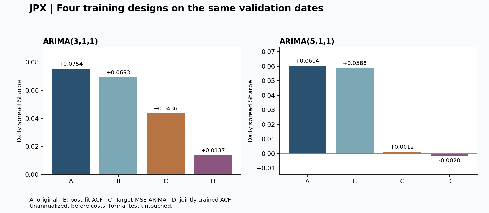
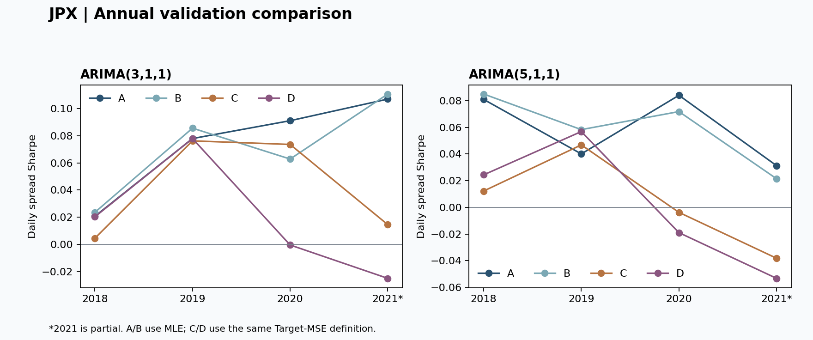

# JPX：ARIMA 與 ACF 共同訓練四組對照

## 完整結果表

依使用者要求，將有無 ACF、原訓練方式及 Target MSE 訓練放在同一張表。A、B 直接沿用前輪預測，沒有重訓；C、D 是本輪實際訓練與回測的新版本。所有指標在共同可評分日期上重新計算，若有排除日期，A、B 指標也會隨比較日期而改變。兩個 ARIMA 階數分開比較，沒有混成一個投資組合。

| 設計 | ARIMA(3,1,1) Sharpe | ARIMA(5,1,1) Sharpe |
|---|---:|---:|
| A：原始 ARIMA（MLE） | +0.075442 | +0.060424 |
| B：原始 ARIMA＋事後 ACF | +0.069266 | +0.058801 |
| C：Target MSE 訓練 ARIMA | +0.043554 | +0.001237 |
| D：Target MSE 共同訓練 ARIMA＋ACF | +0.013702 | -0.001954 |

全部使用相同 **953 個驗證日**，未年化、未扣交易成本。v7 同期 Sharpe：+0.007679。正式 test 未使用；本輪沿用已多次研究的驗證資料，所以不是獨立確認模型作用的證據。

## 最重要的判讀

- **ARIMA(3,1,1)：D 相對 C 的 Sharpe 差為 -0.029852**；六項對比的近似同時區間仍包含零，沒有足夠證據判定優劣。
- **ARIMA(5,1,1)：D 相對 C 的 Sharpe 差為 -0.003191**；六項對比的近似同時區間仍包含零，沒有足夠證據判定優劣。

- **C−A**：更換 ARIMA 訓練目標與最佳化流程的效果。
- **D−C**：同樣 Target MSE 下，加入共同訓練 ACF 修正部分的增量效果，是本輪主要對比。
- **D−B**：整個新流程對比事後 ACF 的變化；訓練目標與修正強度都改了，不能將差異全部歸因於共同訓練。

這些對比衡量同一歷史驗證流程下的預測表現，不是價格受某種 shock 影響的因果證明。模型保留為研究候選，沒有自動替換原版本。

## 各組究竟訓練了什麼

| 組別 | ARIMA 參數 | ACF 與修正強度 | 損失函數 |
|---|---|---|---|
| A | 原最大概似估計 | 無 ACF 修正 | 原價格模型的 Gaussian 最大概似 |
| B | 固定 A 的參數 | 殘差 ACF lag1、2，強度固定1 | 不再訓練 |
| C | 從 A 出發重新最佳化 AR／MA 係數 | 無 ACF 修正 | JPX Target MSE |
| D | 從 A 出發重新最佳化 AR／MA 係數 | 每個候選重新算殘差 ACF，同時學 λ₁、λ₂ | 與 C 相同的 JPX Target MSE |

Target MSE = 平均[(原始 Target[t] − 預測報酬[t])²]，其中預測報酬[t]=P̂[t+2|t]/P̂[t+1|t]−1。不是預測價格的 MSE，也不是要求兩組的 MSE 數字相同。最佳化時乘上 10⁶ 改善數值尺度，不改變最小值的位置。

對 D，e[t] 是目前候選 ARIMA 的原始一步價格殘差（實際−預測），ρₕ 是它的年度訓練 ACF：

u₁ = λ₁ρ₁e[t]，u₂ = λ₂ρ₂e[t]，0≤λ₁,λ₂≤1。

修正轉回價格單位後：P̂*₁=P̂₁+u₁；P̂*₂=P̂₂+(1+φ₁+θ₁)u₁+u₂。ARIMA 係數變動時，訓練殘差、ρ₁、ρ₂ 都會重新計算，並與 λ₁、λ₂ 一同影響最終 Target MSE。ACF 本身是殘差的統計量，不是額外兩個自由迴歸係數。

兩組保留原始訓練尺度、innovation variance sigma² 與無漂移設定，只最佳化預測相關的 AR／MA 係數；sigma² 在報酬 MSE 下不是直接可識別的自由尺度，因此未一同訓練。AR 平穩／MA 可逆轉換沿用 statsmodels。

## 排名與 MSE 分開檢查

| ARIMA | 組別 | 平均 Rank IC | 驗證 Target MSE |
|---|---|---:|---:|
| (3,1,1) | A | +0.002398 | 0.000599165 |
| (3,1,1) | B | +0.002327 | 0.000599359 |
| (3,1,1) | C | +0.002296 | 0.000623255 |
| (3,1,1) | D | +0.001982 | 0.000624948 |
| (5,1,1) | A | +0.001415 | 0.000601853 |
| (5,1,1) | B | +0.001367 | 0.000601963 |
| (5,1,1) | C | +0.001568 | 0.000602726 |
| (5,1,1) | D | +0.001633 | 0.000622136 |

Target MSE 按所有可觀察股票日平均；Rank IC 按每日相關再平均；Sharpe 則來自前後各200檔的加權多空報酬差，三者不是同一件事。MSE 下降不保證排名改善，訓練 MSE 下降更不等於未見資料的績效改善。

## 分年 Sharpe

| ARIMA | 驗證年 | A 原始 | B 事後 ACF | C MSE | D 共同訓練 |
|---|---:|---:|---:|---:|---:|
| (3,1,1) | 2018 | +0.020602 | +0.023506 | +0.004435 | +0.020226 |
| (3,1,1) | 2019 | +0.077903 | +0.085556 | +0.076192 | +0.077876 |
| (3,1,1) | 2020 | +0.091050 | +0.062801 | +0.073555 | -0.000521 |
| (3,1,1) | 2021 | +0.106982 | +0.110706 | +0.014458 | -0.025110 |
| (5,1,1) | 2018 | +0.080903 | +0.084945 | +0.012241 | +0.024374 |
| (5,1,1) | 2019 | +0.040065 | +0.058266 | +0.046821 | +0.056817 |
| (5,1,1) | 2020 | +0.083988 | +0.071783 | -0.003749 | -0.018953 |
| (5,1,1) | 2021 | +0.031247 | +0.021440 | -0.038153 | -0.053208 |

2021 是部分年度，驗證訊號截至2021-12-01。年度切分與前輪相同，包含依報酬日期對齊的前一年末訊號。沒有挑年份、翻轉訊號或將年度辨認結果當成已完成的 regime 模型。

## 訓練是否成功，以及 λ 學到什麼

共32,000件 C/D 股票年度工作，包含不具訓練條件的後備；實際進入最佳化筆數如下。訓練 MSE 變化以各股票年度的訓練樣本數加權，與同批資料的原 MLE 初始化比較，不能與驗證 MSE 混淆。

| ARIMA | 組別 | 進入最佳化 | 回報收斂 | 訓練 MSE 相對變化 | 目標函數呼叫次數中位數 |
|---|---|---:|---:|---:|---:|
| (3,1,1) | C | 7,699 | 7,699 | -0.35% | 146 |
| (3,1,1) | D | 7,699 | 7,619 | -0.52% | 442 |
| (5,1,1) | C | 7,698 | 7,684 | -0.47% | 253 |
| (5,1,1) | D | 7,698 | 7,103 | -0.67% | 694 |

- (3,1,1) C：optimized=7699、source_unavailable=300、insufficient_targets=1
- (3,1,1) D：optimized=7699、source_unavailable=300、insufficient_targets=1
- (5,1,1) C：optimized=7698、source_unavailable=301、insufficient_targets=1
- (5,1,1) D：optimized=7698、source_unavailable=301、insufficient_targets=1

未收斂但已有有效候選時，依事前設定保留訓練 MSE 最低的已評估參數，包含原始初始化；不是把未收斂紀錄刪掉。原 MLE 不可用時沿用原零分後備；若原 MLE 可用但成熟 Target 不足或初始訓練預測不合法，C、D 均保留原 A 預測，並記錄未執行最佳化。

| ARIMA | λ₁ 中位數 | λ₂ 中位數 | λ₁≈0 | λ₂≈0 | λ₁≈1 | λ₂≈1 |
|---|---:|---:|---|---|---|---|
| (3,1,1) | 0.455105 | 0.172473 | 1739/7699 | 2456/7699 | 1411/7699 | 1390/7699 |
| (5,1,1) | 0.410396 | 0.027799 | 1898/7698 | 2613/7698 | 1237/7698 | 1189/7698 |

邊界判斷容差10⁻⁶。λ接近0表示在本次局部訓練結果中少用該修正，並不單獨證明該訊號沒有作用；也要看ρ與殘差大小。λ接近1不代表已證明有用。

C、D皆從原MLE出發，D的λ從0出發；使用相同 L-BFGS-B 設定（最多100步、最多1500次函數評估、ftol=10⁻⁹、gtol=10⁻⁵、差分步長10⁻⁶、maxls=20）。不同參數數量使實際函數評估次數與耗時不同；沒有保證得到全域最小值。最佳化器可能在停止條件檢查前略超過 maxfun，實際次數已保留。

在 15,397 筆 C、D 都有最佳化的配對中，D 的訓練 MSE 仍高於 C 超過10⁻¹²的有 **1,103 筆**。雖然D在λ=0時可表示C，但不同局部搜尋路徑與固定預算不保證找到較低損失；這是本次試跑的最佳化限制，不能把它誤認為較大模型的理論最小訓練損失一定較高。

## 配對差異的不確定性

| ARIMA | 對比 | Sharpe 差異 | 單項95%區間 | 六項近似同時95%區間 |
|---|---|---:|---|---|
| (3,1,1) | C-A | -0.031888 | [-0.074642, +0.009156] | [-0.088740, +0.024964] |
| (3,1,1) | D-B | -0.055564 | [-0.102196, -0.009260] | [-0.112415, +0.001288] |
| (3,1,1) | D-C | -0.029852 | [-0.060537, -0.001240] | [-0.086704, +0.026999] |
| (5,1,1) | C-A | -0.059187 | [-0.107127, -0.012827] | [-0.116038, -0.002335] |
| (5,1,1) | D-B | -0.060755 | [-0.107053, -0.015840] | [-0.117606, -0.003903] |
| (5,1,1) | D-C | -0.003191 | [-0.032341, +0.025099] | [-0.060042, +0.053661] |

所有對比使用相同日期與相同抽樣：20日循環區塊、2,000次、seed=20260924。單項區間為bootstrap百分位；同時區間用六個對比的最大中心化絕對偏差95%分位作共同半徑。這僅針對本輪固定六項比較，未校正之前25組選模與後續反覆探索，也不是未來年度Sharpe的預測區間。

## 資料界線、後備與核對

- Expanding 起點2017-01-04，年度訓練／驗證沿用原953日切分。每個worker只接收該年度已成熟的Target切片；若訓練價格截止T，最多使用訊號T−2的Target，因為其出場價在T才實現。最後兩個尚未成熟的訊號標籤不參與訓練。
- 跳過殘差初始化前段，至少100個有效成熟Target。C、D使用完全相同的訓練股票日，候選參數不能藉由排除難預測資料來降低MSE。
- 年內ARIMA參數與ACF固定，隨已發生價格更新forward states。ACF在訓練配適時使用整個訓練前綴，因此訓練MSE是配適誤差，不是每個歷史起點當時可取得資訊下的獨立預測誤差。
- 缺失日期保留；ACF只使用中心化後有效配對，至少100個有效殘差、lag1和lag2各80對。不加入殘差截距、反向修正或λ大於1的放大，也沒有額外正則化或驗證集早停。
- 沿用JPX完整唯一排名、同分按股票代碼、前後各200檔、2到1線性權重。非法／非正預測給零分，數值失效只從當時起影響後續預測；股票不被刪掉，不裁切有限極端值。
- 本輪 192 次固定樣本的截斷／未來資料擾動核對通過；原參數初始化與存檔價格預測一致，λ=0時兩組目標一致，訓練最佳損失不高於初始化，平穩／可逆根與λ界線均核對。
- 八個版本的完整排名及官方Sharpe獨立重算通過；A、B與前輪逐日結果重現，v7沿用前輪核對過的同期參照。來源資料雜湊一致，正式test未讀取。所有指標使用相同 953 日，排除日期：無。
- 原始Target與因果價格比值間的微小差異沿用前輪揭露，使用原始Target，不自行覆寫。結果未納入交易成本、成交限制或新的獨立測試資料。

| ARIMA | 新組別 | 零分後備股票日比例 | 入選前後200的後備次數 |
|---|---|---:|---:|
| (3,1,1) | C | 1.67% | 0 |
| (3,1,1) | D | 1.67% | 0 |
| (5,1,1) | C | 1.69% | 0 |
| (5,1,1) | D | 1.69% | 0 |

## 檔案

資料包包含固定設定、訓練與評估程式、壓縮參數檢查點、訓練稽核、四個新版本的每日分數／名次、每日績效與分年表。為節省磁碟，不重複包含原價格、訓練Target快取或上一輪大型資料包；重跑仍依賴本機原始JPX資料與前輪結果。

此表可用於企劃中的「共同訓練是否提供增量價值」段落。若要主張ARIMA具有可重複的真實預測價值，仍需先固定研究決策，再用未參與選模的資料確認；不能僅根據這張已重複使用驗證資料的表下定論。[時間序列驗證參考](https://otexts.com/fpp3/tscv.html)
