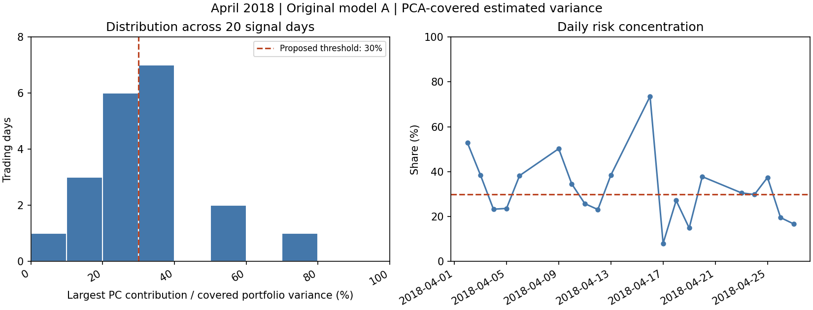

# 2018 年 4 月：原模型最大 PC 風險貢獻占比分布

本次只描述已保存的每日事前風險估計，沒有重新訓練、產生新策略、讀取 Target 或使用保留 test。
C_t = max_k[lambda_k (w_A^T v_k)^2] / sum_k[lambda_k (w_A^T v_k)^2]。分子是原持倉的最大方向變異貢獻；分母限於 PCA 能涵蓋的原持倉部分，不是含缺資料股票在內的全資產風險，也不是波動率相加。
每日使用當時最多 252 個市場交易日估計，沒有先用完整 4 月估一套方向回套。月統計是上述每日比例的等權描述，並非先加總變異再相除。

## 結果

- 20 個訊號日；嚴格超過 30%：10 天（50%），等於 30%：0 天。
- 平均 32.22%；中位數 30.19%。
- 第 25% / 75% 分位數：23.25% / 38.31%（線性插值）。
- 最低 8.05%（2018-04-17）；最高 73.56%（2018-04-16）。
- 最大持倉風險貢獻方向：PC1 2 天、PC2 6 天、PC3 12 天。每天 PC 編號可能改變，並不代表跨日期固定的同一經濟因子。
- PCA 涵蓋的 gross 持倉比平均 96.16%，最低 93.25%。這是部位涵蓋率，不是風險涵蓋率；未涵蓋股票風險未知。

依使用者提出的 30% 門檻，當月有一半日期超標。這只確認該特徵在 4 月的分布；尚未比較其他月份，也未證明 30% 能解釋 B_MAX 的改善。不根據本次分布另改門檻。

## 每日資料

| 訊號日期 | 最大方向 | 風險占比 | 超過 30% |
|---|---:|---:|---|
| 2018-04-02 | PC2 | 52.94% | 是 |
| 2018-04-03 | PC2 | 38.54% | 是 |
| 2018-04-04 | PC1 | 23.29% | 否 |
| 2018-04-05 | PC3 | 23.63% | 否 |
| 2018-04-06 | PC3 | 38.24% | 是 |
| 2018-04-09 | PC3 | 50.24% | 是 |
| 2018-04-10 | PC3 | 34.52% | 是 |
| 2018-04-11 | PC2 | 25.77% | 否 |
| 2018-04-12 | PC2 | 23.14% | 否 |
| 2018-04-13 | PC3 | 38.50% | 是 |
| 2018-04-16 | PC2 | 73.56% | 是 |
| 2018-04-17 | PC3 | 8.05% | 否 |
| 2018-04-18 | PC2 | 27.16% | 否 |
| 2018-04-19 | PC1 | 14.88% | 否 |
| 2018-04-20 | PC3 | 37.79% | 是 |
| 2018-04-23 | PC3 | 30.56% | 是 |
| 2018-04-24 | PC3 | 29.81% | 否 |
| 2018-04-25 | PC3 | 37.44% | 是 |
| 2018-04-26 | PC3 | 19.55% | 否 |
| 2018-04-27 | PC3 | 16.74% | 否 |

## 來源與保存

來源為 ../jpx_pca_random_2018_20260929/results/states 的 20 份每日 NPZ；逐檔 SHA-256 已對照原 generation_audit.json，並核對最大方向與原 B_MAX 選擇一致。原實驗程式及小型結果保存於 Git 提交 f14b6a1701b9e0a6092aa59c67a10a806bc4900b。
本次衍生程式、完整每日 CSV、摘要和圖表均屬小型檔。原大型 PCA 狀態仍沿原 sync_status.json 列為待發布 Release，不能因本次小型衍生結果已保存就視為原大型資料已封存完成。沒有刪除來源或輸入。
