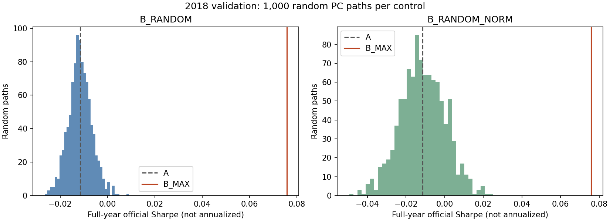
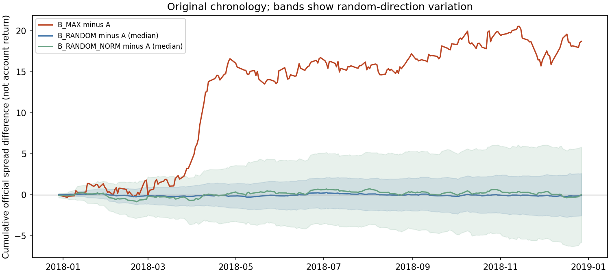

# 2018 隨機 PC 對照結果

完成日期：2026-09-29。這是已反覆使用的歷史 validation 機制對照，沒有使用保留 test，也沒有替換正式基準 v7_equal。

**2018 年內，B_MAX 的官方未年化 Sharpe 為 0.075797，高於普通隨機 PC 與等幅隨機 PC 各自的全部 1,000 條年度路徑。** 即使將分數改動幅度匹配到 B_MAX，結果仍然成立。不過全年累積 spread 改善的約 69.5% 發生在 2018 年 4 月，因此不能將這個結果解讀成跨年度穩定有效。

## 實驗範圍與固定規則

- 使用原 ValidationYear=2018 的 245 個評分日，訊號日期 2017-12-29 至 2018-12-27。年度標籤沿原實驗，不自行改成曆年。
- 原模型使用已保存的因果預測；價格暖身沿原 2017 資料，每日 PCA 使用當時最多 252 個市場交易日。沒有用全年資料估一套方向再倒套。
- 每天重建 A 的完整股票池、分數和排名。B_MAX 挑選原持倉在當日 PCA 下估計變異貢獻最大的非零方向，沿原公式完全移除該方向的分數投影，再按 JPX 規則排名。
- B_RANDOM 每天均勻抽取一個當日非零 PC，用相同的完整投影移除公式。抽到 B_MAX 方向也是合法抽取。
- B_RANDOM_NORM 使用與 B_RANDOM 完全相同的抽取序列，但把扣除向量的 L2 長度匹配到當日 B_MAX；保留投影係數符號。這是等幅擾動對照，可能放大原本很小的投影，不宣稱仍是完全正交的 PC 消融。
- 每組 1,000 條完整年度路徑，固定 numpy PCG64 seed=20260929，依日期升序抽取。沒有重抽日期、挑最佳種子或按結果更換候選方向集合。
- 所有每日 PCA 狀態、可重建分數的向量/係數、候選完整排名與亂數選擇均保存後，才讀取 TRAIN 中的 Target 評分。沒有入選股票缺標籤，全部組別使用相同 245 日。
- [固定計畫](experiment_plan.md)已在隨機對照評分前提交：`39699ca0cd7c26ead166510ee3d4dba936ec8234`。2018 年原 A/B_MAX 績效當時已知，這不是未見資料的預註冊檢定。

## 全年結果

所有 Sharpe 均為官方未年化口徑。

| 組別 | Sharpe／隨機路徑中位數 | 隨機路徑第 2.5%–97.5% 分位數 | 隨機路徑最高值 | B_MAX 高於該組路徑 |
|---|---:|---:|---:|---:|
| A 原模型 | -0.011514 | — | — | — |
| B_MAX | 0.075797 | — | — | — |
| B_RANDOM | -0.011722 | [-0.021328, -0.001535] | 0.009089 | 1,000 / 1,000 |
| B_RANDOM_NORM | -0.011542 | [-0.034008, 0.010726] | 0.025079 | 1,000 / 1,000 |

普通隨機組有 477 / 1,000 條路徑優於 A；等幅隨機組有 497 / 1,000 條優於 A。兩組中位數都接近 A，沒有顯示「隨便移除一個 PC 通常就能獲得 B_MAX 的提升」。



圖中灰虛線是 A、紅線是 B_MAX。這裡的分位範圍描述同一段市場資料下，隨機選方向造成的差異；**不是 Sharpe 信賴區間，也不是新市場資料的預測區間。** 沒有將 1,000/1,000 解讀成 100% 有效機率、正式 p 值或跨年度保證。兩組使用共同亂數，也不能把它們算成 2,000 個獨立市場樣本。

## 對照改動幅度是否接近

| 組別 | 平均扣除分數向量 L2 長度 | 平均每日相對 A 換入股票數（多空合計） | 平均每日與 A 的持倉 L1 差 |
|---|---:|---:|---:|
| B_MAX | 0.02812990 | 51.4204 | 0.26672191 |
| B_RANDOM | 0.00539589 | 10.3103 | 0.05390478 |
| B_RANDOM_NORM | 0.02812990 | 51.1014 | 0.26670638 |

等幅組每天的分數改動長度按設計匹配；全年平均換股數和持倉差也恰好接近 B_MAX，但沒有按績效或換股結果再次篩選對照。這裡的換入股票數是與**同日 A** 比較，不是相鄰日期的交易換手率。

## 改善如何形成

| 組別 | 平均每日 spread | spread 樣本標準差 | 平均每日 RankIC |
|---|---:|---:|---:|
| A | -0.01232985 | 1.07087869 | -0.00131768 |
| B_MAX | 0.06412388 | 0.84599400 | 0.00492179 |
| B_RANDOM（路徑統計平均） | -0.01243070 | 1.07186056 | -0.00129264 |
| B_RANDOM_NORM（路徑統計平均） | -0.01219253 | 1.06601222 | -0.00102243 |

B_MAX 在這一年同時改善平均 spread 與波動。RankIC 作為次要診斷亦較高。spread 是 JPX 官方尺度，不能直接當帳戶百分比或複利報酬。



圖中紅線為累積的 B_MAX − A 官方每日 spread；藍/綠線為各隨機組的逐時點中位數，色帶為該時點隨機路徑的第 2.5%–97.5% 分位數，並非同時信賴帶。

全年 spread 差加總為 **18.731163**；其中 **2018 年 4 月為 13.022960，占約 69.5%**。4 月 A 的 spread 加總為 -13.014685，而 B_MAX 約 0.008276。結果主要顯示 B_MAX 避開了原模型在該月份的明顯損失，差距沒有全年均勻累積。這個比例是 spread 加總的貢獻，不能說成 69.5% 的 Sharpe 改善。[完整逐月資料](results/monthly_spread_difference.csv)包含所有月份，未因結果挑月份重算。

## 可以與不可以推論什麼

這次結果增加了以下證據：在已知的 2018 年資料、既定原模型及排名規則下，「選擇最大估計風險貢獻方向」比均勻隨機選 PC 有用，而且優勢在分數擾動幅度相近時仍存在。

它沒有排除年度選擇偏差，也沒有隔離所有其他機制，例如最大風險方向與低編號/高變異 PC 的差別；更不能直接推論未來會延續。2018 原本就是已知 B_MAX 改善最大的年度。本次不確定性來自隨機方向，先前 bootstrap 評估的是歷史時段抽樣下的不確定性，兩者回答不同問題。

下一步若繼續，應把固定規則原樣延伸到 2019–2021，完整報告各年與合併結果。這些年份同樣是既有 validation，不會因重新切分就變成未見 holdout。本次只執行使用者指定的 2018，正式 test 仍保留。

## 數值核對與保存狀態

- A 原始排名逐筆重現；A/B_MAX 的 245 日 spread 與舊結果最大差約 4.77e-15。
- 22 組預定日期/PC 的 spread 與 RankIC 使用獨立逐筆公式核對通過。
- 第一天全部 PC 的投影正交殘差最大約 5.61e-18；PC 符號反轉不改結果；所有日期等幅誤差最大約 7.22e-16。
- 1,000 條抽取序列已由固定種子獨立重生核對；245 份每日狀態在評分前逐檔核對 SHA-256。
- 見 [verification.json](verification.json)、[來源清單](input_manifest.json)、[生成稽核](results/generation_audit.json)、[評分快照](results/results.json)。原始資料取自已驗證的 snapshot-2026-09-24。
- 小型程式、報告、圖、逐路徑摘要與稽核資料可同步 Git。另有 **247 個大型逐筆檔，共 1,254,437,351 bytes**，包括所有每日候選完整排名/PCA 狀態、逐候選績效與逐路徑時間序列；尚未發布新的 Release。現有 GitHub 連接器沒有 Release/附件上傳功能，環境也沒有已配置的 gh。所有新逐筆檔與本次輸入均保留，未進行清理；不能宣稱全部資料已完成遠端封存。詳見 [sync_status.json](sync_status.json)。

## 重跑

在原儲存庫根目錄，先依 docs/DATA_GUIDE.md 下載並驗證來源至任務專屬目錄；只需兩個實際輸入：

```bash
python scripts/data_archive.py fetch --tag snapshot-2026-09-24 --experiment jpx_v7_daily_mse_20260912/v7_equal/ranks_2018.csv.gz --dest /absolute/task-input
python scripts/data_archive.py fetch --tag snapshot-2026-09-24 --experiment project_archive_20260924/external_sources/JPX_data.zip --dest /absolute/task-input
python research/jpx_pca_random_2018_20260929/run_experiment.py --input /absolute/task-input --zip /absolute/task-input/research/project_archive_20260924/external_sources/JPX_data.zip --out /absolute/new-results --stage all
```

輸出目錄必須全新。依賴 numpy、pandas、scipy、threadpoolctl、matplotlib；實際版本記錄於生成稽核。程式沿用固定的原 run_ab.py 及舊 daily_scores.csv 作為數值核對來源，不重新訓練原模型。
