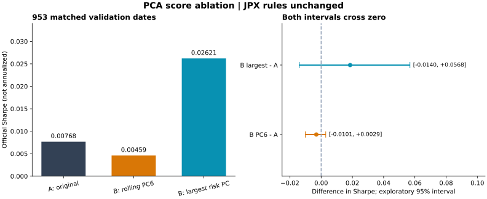

# JPX PCA 分數消融：共同方向是否有幫助？

2026-09-28｜正式基準 v7_equal｜既有 validation 953 日｜未使用保留 test

**這次沒有找到「應該全面移除 PC6」的證據。** 原報告同一天、同一 PC6 的單日移除確實提高 spread；但逐日重新估計後，每期移除第六方向的總 Sharpe 反而下降。另一個事先固定的診斷——每天移除原持倉「被 PCA 涵蓋部分」最大估計風險方向——總分較高，但年度效果不一致，差異探索區間跨 0，尚不足以取代正式基準。

## 確實遵守 JPX 的限制

全部版本以分數排序，取多空各 200 檔，各側極端名次權重 2→1。沒有手動調權重、刪除科技股、改訓練參數或更換 Target。B 只改預測分數，再由相同 JPX 規則決定配置。

先只用價格和已保存 v7 預測，逐日完成並保存所有 B 分數／排名／方向；再獨立讀未來 Target 評分。A 的全部原排名重現，逐日 spread 與原保存值最大差為 4.44e-15。三組再以原官方評分函數獨立核對。

## 先回答你指的「原報告那個 PC6」

原報告是 2021-12-01 持倉、1,933 檔股票、252 日窗口中的 160 個共同可觀測日期。重建後，PC6 特徵值、原持倉曝險及原風險占比全部吻合。

| 原報告同一訊號日 | A 原分數 | B 扣除該 PC6 成分 |
|---|---:|---:|
| 官方單日 spread | 0.07318396 | 0.22429768 |
| 單日 Rank IC | -0.019477 | -0.014260 |
| PC6 占估計持倉變異數 | 9.76% | 1.19% |
| 相較 A 更換的多頭股票 | 0 | 5 |
| 相較 A 更換的空頭股票 | 0 | 6 |

**這一天，移除後的排名更有利。** 單日 spread 增加 0.15111373；同一基底涵蓋 A/B 的全部持倉。使用的是原 2021-12-01 Target，對應 12/02 至 12/03 報酬，沒有把這個後來識別的方向倒套更早日期。

只有一個訊號日，不能計算 Sharpe，也不能證明長期效果。spread 是官方計分量，不是帳戶百分比報酬；不能將上述差值當作 15.11% 獲利。

## 953 日：規則能否反覆使用？

兩個 rolling B 都是在看結果前固定：B_PC6 移除每期第六大特徵值的方向；B_MAX 移除當期對 A 被涵蓋持倉變異數貢獻最大的方向。這兩者都不代表同一固定「科技因子」。

| 版本 | 官方未年化 Sharpe | 平均 Rank IC | 平均官方 spread | spread 樣本標準差 |
|---|---:|---:|---:|---:|
| A 原版 | +0.00767887 | -0.00073389 | +0.009117 | 1.187223 |
| B：每期第六方向 | +0.00459482 | -0.00074775 | +0.005405 | 1.176292 |
| B：每期最大估計風險方向 | +0.02620535 | +0.00084135 | +0.024806 | 0.946618 |

所有 953 日三組入選 Target 均完整，不需因缺標籤刪日期。Rank IC 有 952 日可定義：2020-09-29 原 Target 全部為零，相關係數沒有定義，該日仍保留於 Sharpe。

**移除每期 PC6：**相較原版 Sharpe 差 -0.00308406；spread 標準差略低，但平均 spread 也降低，總分沒有改善。這支持「目前沒有理由普遍刪除每期第六方向」，不等於證明 PC6 是穩定 alpha。

**移除每期最大估計風險方向：**Sharpe 差 +0.01852648；平均 spread 增加、標準差下降，平均 Rank IC 也改善。此為值得保留的診斷候選，尚未確認可靠優勢。

| 原 validation 年度標籤 | A | B_PC6 | B_MAX |
|---|---:|---:|---:|
| 2018 | -0.01151 | -0.02597 | +0.07580 |
| 2019 | +0.05007 | +0.05556 | +0.04142 |
| 2020 | +0.05086 | +0.05081 | +0.02597 |
| 2021 | -0.08760 | -0.09182 | -0.04338 |

B_MAX 改善 2018 與 2021，但 2019、2020 低於 A；2021 仍負。合併 Sharpe 由全部逐日 spread 重算，不平均年度分數。年度標籤沿原資料，首個訊號日可能落在前一年的最後交易日。

以相同日期成對 stationary block bootstrap（平均區塊 20 日，5,000 次，固定 seed）得到 Sharpe 差異的探索 95% 區間：

- B_PC6 − A：[-0.01013, +0.00293]。
- B_MAX − A：[-0.01403, +0.05684]。

兩者皆含 0。這些區間未校正重複使用 validation 或後續研究選擇，不能當成新保留樣本的顯著性證明。

## B 實際改了什麼

對當期 PCA 涵蓋股池的 loading v 做橫斷面去平均 q = v − mean(v)，原分數 s 也去平均；回歸斜率 b = qᵀ(s − mean(s)) / (qᵀq)，再用 s_B = s − bq 排名。

保留分數平均，固定移除 100% 線性成分，沒有挑最佳移除比例。向量正負整體翻轉不影響結果。未涵蓋股票維持原分數，仍可進入多空名單。這是分數消融，不是重新訓練模型，也不是直接把持倉投影設為零。

- B_PC6 平均移除分數橫斷面變異數的 0.54%；每天平均更換約 8 檔多頭、8 檔空頭。740/953 日的原 PC6 估計風險貢獻下降，總 Sharpe 仍下降。
- B_MAX 平均移除 3.71%；每天平均更換約 25 檔多頭、26 檔空頭。939/953 日的所選方向估計風險貢獻下降。
- B_MAX 最常選 PC2（385 日）、PC3（285 日）、PC1（170 日）；選 PC6 只有 6 日。因此不能把 B_MAX 的改善解讀為「移除科技股 PC6 有效」。
- 排名到權重是非線性步驟，分數與 loading 正交並不保證實際持倉曝險為零。結果也確實有些日期未降低所選方向風險。

## 資料範圍與不能省略的限制

每期使用訊號收盤以前最多 252 個市場交易日，最初 6 日只有 246～251 日。排除全市場休市日，先算相鄰交易日除權調整簡單價格報酬；個股缺價或任一端零成交量保留缺值，不補零、不前填、不裁切。PCA 僅減時間平均，不按個股標準差縮放。

每期原排名股池不變；PCA 完整欄股票最少 1801 檔，中位數 1846 檔。A 持倉 gross 平均涵蓋 94.69%，最低 79.34%，缺資料股票的風險未知。B_MAX 的「最大風險」只針對被涵蓋持倉，不代表完整組合。這個覆蓋缺口可能影響選中哪個方向。

原快照的同一 PC6 用共同 160 日；rolling 比較用每期完整股票的最多 252 日。這是兩種估計樣本，不能把各自 PC6 視為相同因子。近似特徵值亦可導致方向轉動；每日 PC6 與前日共同股票上的絕對 cosine 中位數約 0.9990，有 17 次低於 0.5。

原價格風險不含股息；Target 沿用 JPX 原定義，兩者用途不同。本輪未重跑訓練，也沒有使用保留 test。953 日 validation 已反覆參與開發，這是按歷史時序產生預測的探索比較，不能稱為新的樣本外保留測試。

未估計交易／借券成本。相鄰日期目標權重 L1 變化平均：A 約 1.4748、B_PC6 約 1.4754、B_MAX 約 1.4819；這只是忽略價格漂移的換手診斷，不是實際成本或扣成本績效。

## 對模型下一步的意義

正式基準維持 v7_equal。原報告的那個 PC6 在單日例子中移除有幫助，但沒有足夠後續日期支持長期結論；每期固定移除第六方向未改善全期分數。

B_MAX 可保留為下一輪研究候選。優先檢查缺值股票造成的風險覆蓋差異、年度不一致及後續期間穩定性；在新的檢查前固定規則，避免繼續搜尋移除比例或 PC 編號直到分數漂亮。若最後改善仍存在，改進的是「分數到排名」的處理，而不是手動修改 JPX 的配置公式。

## 核對、失敗紀錄與檔案

7 項核心測試通過：未來資料變更不影響歷史 PCA、分數截距與向量符號不變性、消融公式、直接 SVD 對照、官方排名配重、入選缺標籤處理、缺價不跨日橋接。真實 953 日正交性、特徵方程、風險分解、原排名與原 spread 核對通過；另於事先固定 5 個日期做直接 SVD 對照。完整逐年 NPZ 已做大小、SHA-256 與 ZIP CRC 核對。

第一次運算產生的 2019 中間 NPZ 寫入不完整，評分拒絕該檔。改為完成寫入、fsync、校驗、原子更名後，依相同計畫重跑。第一次其餘三個完整年度 NPZ 與最終版本位元組一致，沒有改變研究設計。失敗輸出保留於 results；最終以 results_v2 為準。

- [逐日 A/B 分數](results_v2/daily_scores.csv)、[年度與全期摘要](results_v2/summary.csv)、[完整數值摘要](results_v2/results.json)。
- [原 PC6 單日結果](exact_snapshot_results/result.json)、[原 PC6 逐股分數與排名](exact_snapshot_results/predictions_before_labels.csv)。
- [固定計畫](experiment_plan.md)、[單日補充計畫](exact_snapshot_plan.md)、[數值核對](verification.json)。
- 大型逐筆分數／排名／loading／特徵值／曝險在 results_v2/traces；每檔約 21–22 MB，保留全部 1,864,363 個股票日。資料發布狀態见 [同步狀態](sync_status.json)。

來源：Git commit 95592531e6c8132988d43cc87cd563da653ad28e；catalog snapshot-2026-09-26-v32-chunk-replay；原 ranks 位於 snapshot-2026-09-24。評分使用 repo 保存的原 [JPX 官方函數](references/official_metric_reference.py)，原來源為 [JPX Competition Metric Definition](https://www.kaggle.com/code/smeitoma/jpx-competition-metric-definition)。
